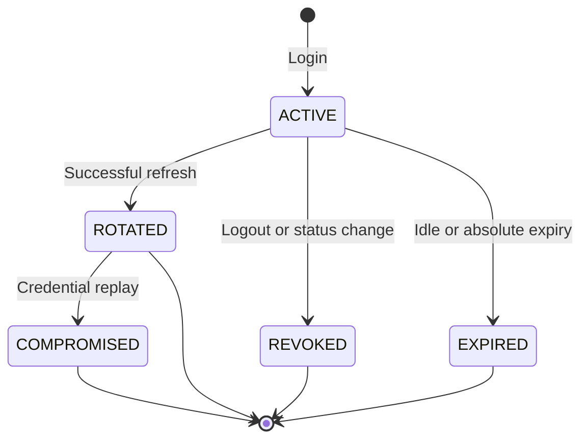

# Volume 07 — Security Bible: Authentication and Sessions

**Decision:** ADR-003

**Status:** S0.3 implementation in progress

## Security invariants

1. Identity is global; tenant access exists only through an active `TenantMembership`.
2. The client never supplies authoritative tenant or user context.
3. Every route is protected unless explicit shared public metadata is present.
4. Access JWTs use RS256 and strict issuer, audience, algorithm, token type, key ID, expiry, and UUID claim validation.
5. Every protected request revalidates the active session, membership, user, and tenant chain.
6. Refresh credentials are opaque, random, single-use, and stored only as a peppered HMAC-SHA-256 digest.
7. Rotation is serializable; replay compromises the active family.
8. Logout and logout-all are derived from authenticated self context.
9. Authentication attempts are limited across instances with Redis.
10. Credentials, keys, digests, emails, and authorization headers are excluded from security logs.

## Required configuration

| Variable                            | Rule                                                    |
| ----------------------------------- | ------------------------------------------------------- |
| `AUTH_JWT_PRIVATE_KEY_BASE64`       | Padded base64 PKCS#8 RSA private PEM, at least 2048-bit |
| `AUTH_JWT_PUBLIC_KEY_BASE64`        | Matching padded base64 SPKI RSA public PEM              |
| `AUTH_JWT_ISSUER`                   | Clean absolute HTTPS URL                                |
| `AUTH_JWT_AUDIENCE`                 | Explicit service audience                               |
| `AUTH_JWT_KEY_ID`                   | Stable non-secret identifier                            |
| `AUTH_ACCESS_TOKEN_TTL_SECONDS`     | 60–3600                                                 |
| `AUTH_REFRESH_IDLE_TTL_SECONDS`     | 300–2,592,000 and not shorter than access TTL           |
| `AUTH_REFRESH_ABSOLUTE_TTL_SECONDS` | 3,600–15,552,000 and not shorter than idle TTL          |
| `AUTH_REFRESH_TOKEN_PEPPER`         | At least 32 random bytes in padded base64               |
| `AUTH_ARGON2_MEMORY_KIB`            | 19,456–262,144                                          |
| `AUTH_ARGON2_TIME_COST`             | 2–10                                                    |
| `AUTH_ARGON2_PARALLELISM`           | 1–8                                                     |
| `REDIS_CLUSTER_URL`                 | Absolute `redis://` or `rediss://` URL                  |
| `ENABLE_SWAGGER`                    | Exact `true` enables docs; otherwise disabled           |

The service fails startup when required authentication or rate-limit configuration is absent or invalid. No fallback key, pepper, TTL, or Redis endpoint is permitted.

## Key generation and rotation

Generate keys only in an approved secret-management environment. Encode complete PEM files as padded base64 and store them in the deployment secret store, never Git, `.env.example`, logs, tickets, or screenshots.

Current S0.3 validation accepts one exact key ID. Rotation therefore uses a coordinated replacement:

1. generate a new RSA pair and unique key ID;
2. deploy the new public/private pair and key ID to the sole issuer;
3. restart issuer instances and confirm new tokens carry the new ID;
4. allow the maximum old access-token TTL to elapse before removing the old public key from any separately deployed verifier;
5. revoke sessions if rotation responds to suspected signing-key disclosure;
6. record the operational change without recording key material.

A future multi-key verification ring requires an ADR before zero-downtime issuer rotation across independently deployed verifiers.

## Session lifecycle

Each rotation creates a new session ID in the same family, preserves absolute expiry, advances idle expiry without passing the absolute limit, links the predecessor, and invalidates access tokens tied to the predecessor. Concurrent use is serialized with bounded retry for Prisma transaction conflicts.

## Threat-control evidence

| Threat                      | Control                                                | Evidence target                       |
| --------------------------- | ------------------------------------------------------ | ------------------------------------- |
| Algorithm/token confusion   | RS256 allowlist, access type, issuer/audience/key ID   | Token negative unit/API tests         |
| Client tenant impersonation | Membership-derived tenant and exact claim-chain lookup | Cross-tenant PostgreSQL test          |
| Database credential leak    | HMAC digest only with external pepper                  | Schema/repository assertion           |
| Refresh replay              | Single-use predecessor plus family compromise          | Sequential replay PostgreSQL test     |
| Concurrent refresh          | Serializable transaction and bounded retry             | Parallel PostgreSQL test              |
| Logout bypass               | Live session lookup on every protected request         | Protected-route lifecycle test        |
| Account enumeration         | Generic responses and dummy password verification      | Response and service tests            |
| Credential guessing         | Redis network plus account/session counters            | Redis integration and API limit tests |
| Secret disclosure in logs   | Allowlisted event shape                                | Log capture/review                    |
| Prototype route exposure    | Unmounted modules plus deny-by-default guard           | Route inventory test                  |

## Accepted limitations

- MFA, recovery, email verification delivery, invitations, device management, OIDC/SAML, ABHA/ABDM, and break-glass workflows are not implemented.
- S0.3 event logs are not the final healthcare audit trail.
- RBAC permissions and policy evaluation remain blocked until S0.4.
- Legal compliance certification and production readiness are not claimed.
