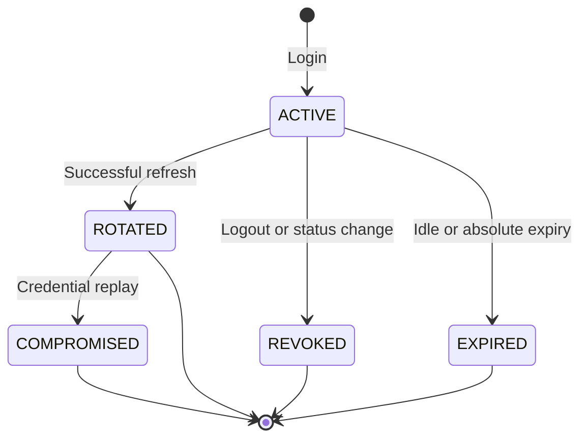

# Volume 07 — Security Bible: Identity, Authorization, and Audit

**Decisions:** ADR-003 through ADR-007

**Status:** S0.3–S0.5 and G3.1 accepted; G3.2 security target active

## Security invariants

1. Identity is global; tenant access exists only through an active `TenantMembership`.
2. The client never supplies authoritative tenant or user context.
3. Every route is protected unless explicit shared public metadata is present.
4. Access JWTs use RS256 and strict issuer, audience, algorithm, token type, key ID, expiry, and UUID claim validation.
5. Every protected request revalidates the active session, membership, user, and tenant chain.
6. Refresh credentials are opaque, random, single-use, and stored only as a peppered HMAC-SHA-256 digest.
7. Rotation is serializable; replay compromises the active family.
8. Logout and logout-all are derived from authenticated self context.
9. Authentication attempts are limited across instances with Redis.
10. Credentials, keys, digests, emails, and authorization headers are excluded from security logs.
11. Access-token header and claim validation is shared by direct verification
    and the Passport strategy so algorithm, type, key ID, token-use, and UUID
    checks cannot drift across code paths.
12. Account throttle locators use the same canonicalization as login and
    registration DTOs even though guards execute before request pipes.
13. Authorization is derived from the current active membership and tenant in
    PostgreSQL on every guarded request; access tokens never carry permissions.
14. Role and assignment tenant boundaries are enforced by composite foreign
    keys, not only by application filters.
15. Missing or unknown permission metadata denies access. There are no
    wildcard, client-defined, or runtime-seeded permissions.
16. The permission catalogue is migration-owned and protected from runtime
    insert, update, and delete.
17. The tenant administrator role is protected, and serializable transactions
    preserve at least one active administrator under concurrent removals.
18. Required role, assignment, and session audit evidence commits atomically
    with the protected mutation.
19. Durable audit events are attributable, bounded, append-only, and validated
    at both the application and database boundaries.
20. Platform-scoped events are never returned through tenant audit APIs.
21. Request identifiers and bounded network/client metadata are propagated for
    correlation without recording credentials or request bodies.
22. Rejected prototype applications cannot start outside explicit development.
23. HTTP security headers and safe error/request-ID handling are shared.
24. Prisma query logging is default-off and forbidden in production.
25. Moderate-or-higher production dependency advisories block acceptance.

## Required configuration

| Variable                            | Rule                                                    |
| ----------------------------------- | ------------------------------------------------------- |
| `AUTH_JWT_PRIVATE_KEY_BASE64`       | Padded base64 PKCS#8 RSA private PEM, at least 2048-bit |
| `AUTH_JWT_PUBLIC_KEY_BASE64`        | Matching padded base64 SPKI RSA public PEM              |
| `AUTH_JWT_ISSUER`                   | Clean absolute HTTPS URL                                |
| `AUTH_JWT_AUDIENCE`                 | Explicit service audience                               |
| `AUTH_JWT_KEY_ID`                   | Stable non-secret identifier                            |
| `AUTH_ACCESS_TOKEN_TTL_SECONDS`     | 60–3600                                                 |
| `AUTH_REFRESH_IDLE_TTL_SECONDS`     | 300–2,592,000 and not shorter than access TTL           |
| `AUTH_REFRESH_ABSOLUTE_TTL_SECONDS` | 3,600–15,552,000 and not shorter than idle TTL          |
| `AUTH_REFRESH_TOKEN_PEPPER`         | At least 32 random bytes in padded base64               |
| `AUTH_ARGON2_MEMORY_KIB`            | 19,456–262,144                                          |
| `AUTH_ARGON2_TIME_COST`             | 2–10                                                    |
| `AUTH_ARGON2_PARALLELISM`           | 1–8                                                     |
| `REDIS_CLUSTER_URL`                 | Absolute `redis://` or `rediss://` URL                  |
| `ENABLE_SWAGGER`                    | Exact `true` enables docs; otherwise disabled           |

The service fails startup when required authentication or rate-limit configuration is absent or invalid. No fallback key, pepper, TTL, or Redis endpoint is permitted.

## Key generation and rotation

Generate keys only in an approved secret-management environment. Encode complete PEM files as padded base64 and store them in the deployment secret store, never Git, `.env.example`, logs, tickets, or screenshots.

Current S0.3 validation accepts one exact key ID. Rotation therefore uses a coordinated replacement:

1. generate a new RSA pair and unique key ID;
2. deploy the new public/private pair and key ID to the sole issuer;
3. restart issuer instances and confirm new tokens carry the new ID;
4. allow the maximum old access-token TTL to elapse before removing the old public key from any separately deployed verifier;
5. revoke sessions if rotation responds to suspected signing-key disclosure;
6. record the operational change without recording key material.

A future multi-key verification ring requires an ADR before zero-downtime issuer rotation across independently deployed verifiers.

## Session lifecycle

Each rotation creates a new session ID in the same family, preserves absolute expiry, advances idle expiry without passing the absolute limit, links the predecessor, and invalidates access tokens tied to the predecessor. Concurrent use is serialized with bounded retry for Prisma transaction conflicts.

## Threat-control evidence

| Threat                           | Control                                                        | Evidence target                        |
| -------------------------------- | -------------------------------------------------------------- | -------------------------------------- |
| Algorithm/token confusion        | RS256 allowlist, access type, issuer/audience/key ID           | Token negative unit/API tests          |
| Client tenant impersonation      | Membership-derived tenant and exact claim-chain lookup         | Cross-tenant PostgreSQL test           |
| Cross-tenant privilege injection | Membership/role composite tenant foreign keys                  | Invalid-assignment PostgreSQL tests    |
| Stale or forged authorization    | Current database lookup; no JWT permissions or client context  | Multi-tenant permission tests          |
| Missing policy annotation        | Guard denies when permission metadata is absent or unknown     | Guard unit and application tests       |
| Last-administrator race          | Serializable transaction plus tenant version serialization     | Concurrent PostgreSQL test             |
| Permission-catalogue mutation    | Migration ownership plus database mutation-rejection trigger   | Trigger integration tests              |
| Audit tampering                  | Append-only database trigger and no update/delete API          | PostgreSQL immutability tests          |
| Audit sensitive-data disclosure  | Event allowlists, bounded scalar metadata, minimized API reads | Writer/service tests and manual review |
| Database credential leak         | HMAC digest only with external pepper                          | Schema/repository assertion            |
| Refresh replay                   | Single-use predecessor plus family compromise                  | Sequential replay PostgreSQL test      |
| Concurrent refresh               | Serializable transaction and bounded retry                     | Parallel PostgreSQL test               |
| Logout bypass                    | Live session lookup on every protected request                 | Protected-route lifecycle test         |
| Account enumeration              | Generic responses and dummy password verification              | Response and service tests             |
| Credential guessing              | Redis network plus account/session counters                    | Redis integration and API limit tests  |
| Secret disclosure in logs        | Allowlisted event shape                                        | Log capture/review                     |
| Prototype route exposure         | Unmounted modules plus deny-by-default guard                   | Route inventory test                   |

The HTTP security suite complements, but does not replace, the real adapter
tests. It verifies the assembled Nest application and actual HTTP behavior.
PostgreSQL tests remain authoritative for session rotation, replay, tenant
chains, authorization isolation, audit atomicity, database constraints, and
concurrency. Redis tests remain authoritative for shared counters.

## Accepted limitations

- MFA, recovery, email verification delivery, invitations, device management, OIDC/SAML, ABHA/ABDM, and break-glass workflows are not implemented.
- S0.4 PostgreSQL 16, Redis 7, populated-upgrade, drift, constraint, trigger,
  atomicity, concurrency, and full CI gates passed on the accepted candidate.
- Tenant-administrator assignment is deliberately not automatic. A reviewed
  onboarding/bootstrap workflow is required before tenant self-administration.
- ABAC, consent, privacy, data retention, legal hold, audit export,
  partitioning, cryptographic signing, and break-glass policy remain future
  dependency-ordered work.
- Legal compliance certification and production readiness are not claimed.

## S0.5 security target

ADR-005 requires explicit tenant keys and composite same-tenant relationships
for inventory, batches, movements, medicine reservations, items, allocations,
providers, and actor memberships. Tenant and actor authority continue to come
only from the accepted authenticated identity.

Stock and reservation commands must be serializable, idempotent, versioned
where state transitions occur, and atomic with their durable audit event.
Automatic expiry may use a tenant-scoped `SYSTEM` audit actor only when tenant
scope is explicit and user actor fields are absent.

S0.5 does not authorize public patient reservation creation. That boundary
requires a later Marketplace decision for global-user attribution, patient
self-access, abuse controls, and tenant-scoped audit visibility. No header,
zero UUID, system actor, or client-supplied tenant may be used as a temporary
identity fallback.

## G3.2 command boundary

- Listing, receipt, and adjustment commands require both a dedicated
  migration-owned permission and live `MembershipProviderAccess`.
- Missing provider assignment uses the same not-found response as missing
  provider inventory.
- Idempotency receipt lookup occurs only after provider authorization and the
  canonical command hash must match before replay.
- Client tenant, provider, membership, user, actor, and inventory identifiers
  never override verified identity and path scope.
- Every protected write is serializable and atomic with its stock movement or
  configuration receipt and typed tenant audit event.
