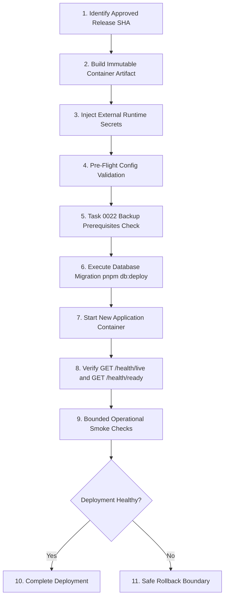

# AIM — All In Medico Production Deployment Runbook

**Document Owner:** CTO Engineering Policy
**Applies to:** Production operations, deployment automation, and release certification

## 1. Overview & Policy Boundary

This runbook documents the provider-neutral production deployment procedure for AIM — All In Medico. All production deployments must strictly follow this order of operations. No ad hoc environment modifications, manual database schema pushes, or unvalidated artifact deployments are permitted.

> [!IMPORTANT]
> **Implemented Foundation vs Not Implemented Infrastructure**:
>
> - **IMPLEMENTED**: Repository-owned fail-closed runtime configuration contract, component classification, secret isolation policy, container security baseline, and release identity validation.
> - **NOT IMPLEMENTED**: Real cloud accounts, DNS/TLS certificates, cloud secret manager bindings, production databases/Redis instances, or active production deployments.

## 2. Environment & Secret Injection Contract

Production environment variables must be injected at runtime by the deployment orchestration platform (e.g. secret manager, container environment injection).

### Repository Responsibility vs Platform Responsibility

- **Repository Responsibility**: Define required environment keys, validate variable shape/syntax at bootstrap, prevent secret leakage in logs/errors, and fail closed if configuration is invalid.
- **Platform Responsibility**: Generate, store, rotate, and securely inject production secrets into the container runtime.

### Production Variable Requirements (`auth-service`)

| Variable Key                        | Value Type    | Rules & Validation                                                 |
| :---------------------------------- | :------------ | :----------------------------------------------------------------- |
| `NODE_ENV`                          | String        | Must be `production`                                               |
| `PORT`                              | Integer       | Optional override; Docker defaults to `3000`; if set, 1-65535      |
| `RELEASE_SHA`                       | Hex String    | Immutable full 40-character hexadecimal commit SHA of the artifact |
| `APP_VERSION`                       | String        | Application release version (e.g. `1.0.0`)                         |
| `DATABASE_URL`                      | Secret URL    | Valid `postgresql://` connection string                            |
| `REDIS_CLUSTER_URL`                 | Secret URL    | Valid `redis://` or `rediss://` connection string                  |
| `AUTH_JWT_PRIVATE_KEY_BASE64`       | Secret Base64 | Padded base64 PKCS#8 RSA private PEM (>= 2048 bits)                |
| `AUTH_JWT_PUBLIC_KEY_BASE64`        | Secret Base64 | Matching padded base64 SPKI RSA public PEM                         |
| `AUTH_JWT_ISSUER`                   | HTTPS URL     | Clean absolute HTTPS URL                                           |
| `AUTH_JWT_AUDIENCE`                 | String        | Service audience identifier                                        |
| `AUTH_JWT_KEY_ID`                   | String        | Stable key identifier                                              |
| `AUTH_ACCESS_TOKEN_TTL_SECONDS`     | Integer       | 60-3600 seconds                                                    |
| `AUTH_RECENT_AUTH_TTL_SECONDS`      | Integer       | 60-3600 seconds                                                    |
| `AUTH_REFRESH_IDLE_TTL_SECONDS`     | Integer       | 300-2592000 seconds; must not be shorter than access-token TTL     |
| `AUTH_REFRESH_ABSOLUTE_TTL_SECONDS` | Integer       | 3600-15552000 seconds; must not be shorter than refresh idle TTL   |
| `AUTH_ARGON2_MEMORY_KIB`            | Integer       | 19456-262144                                                       |
| `AUTH_ARGON2_TIME_COST`             | Integer       | 2-10                                                               |
| `AUTH_ARGON2_PARALLELISM`           | Integer       | 1-8                                                                |
| `AUTH_REFRESH_TOKEN_PEPPER`         | Secret Base64 | At least 32 random bytes in padded base64                          |
| `AUTH_OTP_PEPPER`                   | Secret Base64 | At least 32 random bytes in padded base64                          |
| `ORG_JOIN_CODE_PEPPER`              | Secret Base64 | At least 32 random bytes in padded base64                          |

### Prohibited Production Flags

The following flags MUST NOT be set to `true` in `NODE_ENV=production`:

- `ENABLE_SWAGGER`
- `ENABLE_TEST_VERIFICATION_PROVIDER`
- `ENABLE_UNACCEPTED_PROTOTYPE_SERVICES`
- `ENABLE_PRISMA_QUERY_LOGGING`
- `RUN_AUTH_INFRASTRUCTURE_TESTS`

## 3. Deployment Sequence (Order of Operations)

### Detailed Order of Operations

1. **Approved Release Identification**: Verify the target release commit SHA is approved by CTO review and all GitHub CI quality gates pass.
2. **Immutable Artifact Construction**: Build the production container image (`Dockerfile`) using `TARGET_SERVICE=auth-service`. Do NOT bake environment files (`.env`) or credentials into image layers.
3. **External Secret Population**: Populate environment secrets from the secure platform secret store into the target container environment.
4. **Configuration Pre-Flight Check**: The accepted auth-service bootstrap executes `assertAuthProductionRuntimePolicy()` before `NestFactory.create()`. That policy reuses the accepted `parseAuthEnvironment()` authentication contract and composes the shared infrastructure/runtime validators, failing closed on missing, blank, malformed, or forbidden production configuration before avoidable external connection side effects.
5. **Backup & Recovery Pre-Flight**: Verify the applicable Task 0022 repository-owned logical backup, isolated restore, integrity-verification, recovery-validation, retention, and alert prerequisites. Task 0022 did not activate provider-specific snapshots, PITR, or external backup storage; those provider capabilities must be separately activated and verified before real production approval when required by the selected infrastructure architecture.
6. **Append-Only Database Migration**: Run `pnpm db:deploy` (`prisma migrate deploy`). Never use `prisma db push` or schema reset in production.
7. **Process Launch**: Container starts non-root process (`USER nonroot:nonroot`).
8. **Health & Readiness Verification**:
   - `GET /health/live` must return HTTP `200 { "status": "ok" }`.
   - `GET /health/ready` must return HTTP `200 { "status": "ok" }` (confirming database and Redis connectivity).
9. **Smoke Checks**: Perform non-destructive health and operational verification.
10. **Rollback Boundary**: If readiness fails or smoke checks fail, initiate safe rollback:
    - Stop the new runtime.
    - Revert application container to previous known-good release SHA.
    - Do not assume a schema downgrade is safe. Application rollback is permitted only when the current forward-migrated schema remains compatible with the previous application artifact; otherwise follow the approved Task 0022 recovery controls and migration policy.
